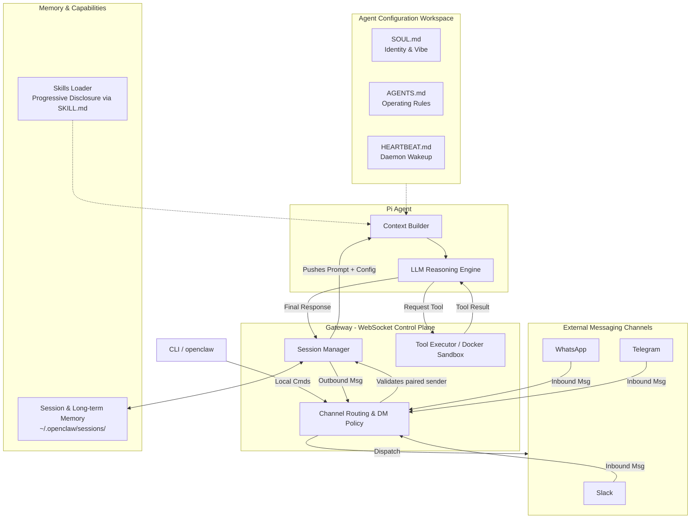

# OpenClaw Architecture Diagram

## Legend

* **Channels**: Inbound connection points bringing user messages from external networks.
* **Gateway (Control Plane)**: The core node running at `ws://127.0.0.1:18789`. It enforces DM pairing policies, manages discrete session isolation, and executes system tools (using Docker sandboxing for non-main sessions).
* **Pi Agent**: The fundamental reasoning loop. It never touches the network directly, relying on the Gateway for physical execution.
* **Config**: The text-based files (`SOUL.md`, `AGENTS.md`) injected into the Pi Agent's system prompt to transform it into a specific persona with behavioural boundaries.
* **Skills Loader**: Reads YAML frontmatter of `SKILL.md` files for quick discovery, passing short descriptions to the agent and revealing full bodies only upon tool invocation.
* **Memory**: File-backed storage for sessions and conversational history (`~/.openclaw/sessions/`), periodically compressed to maintain context constraints.
