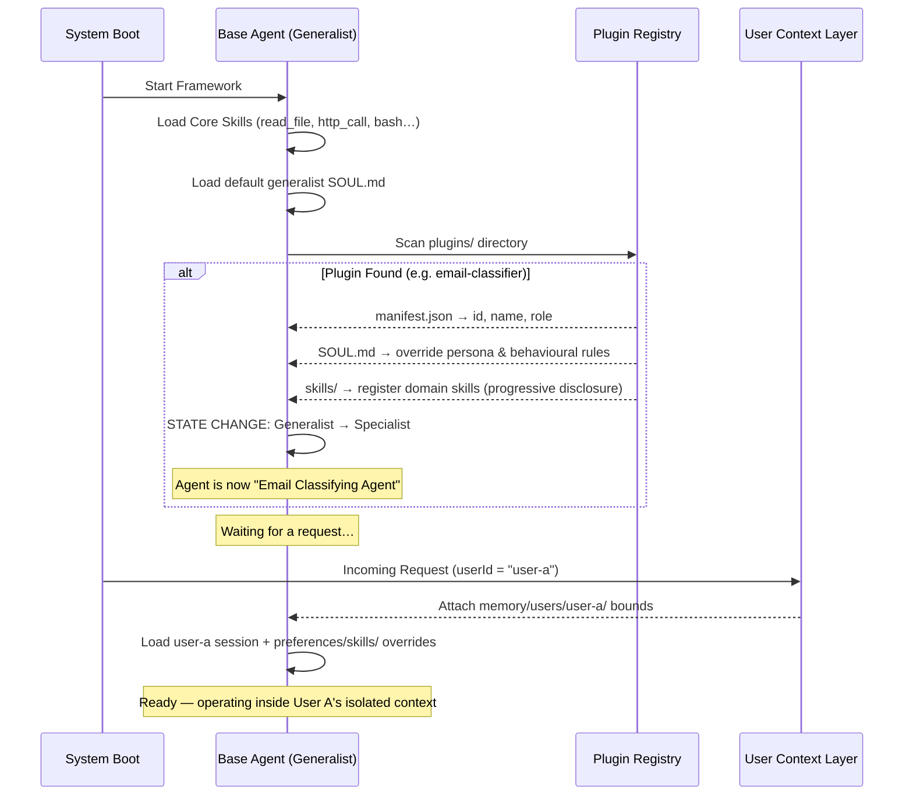
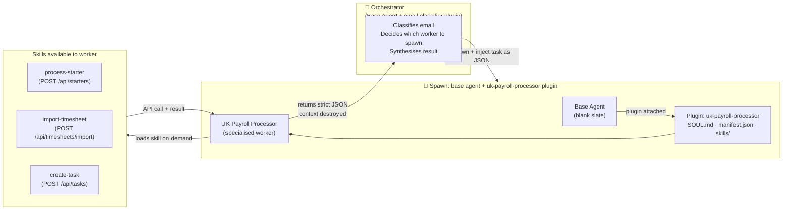
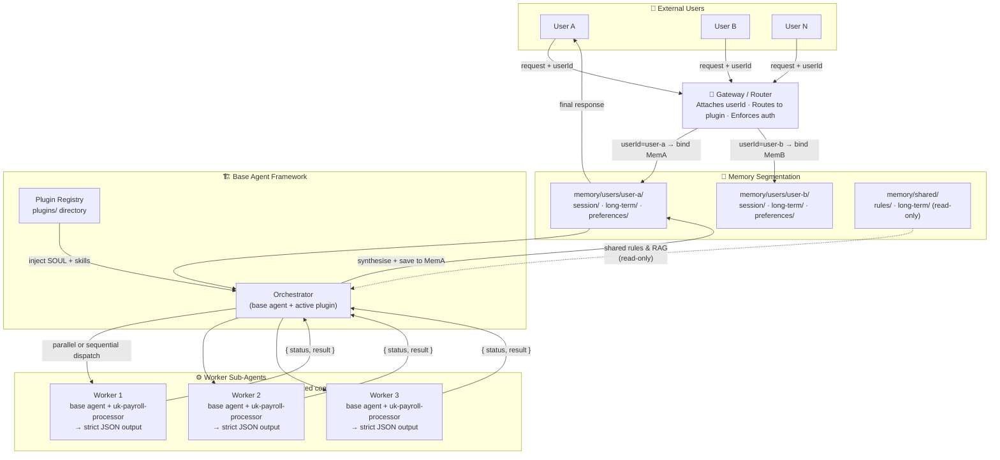
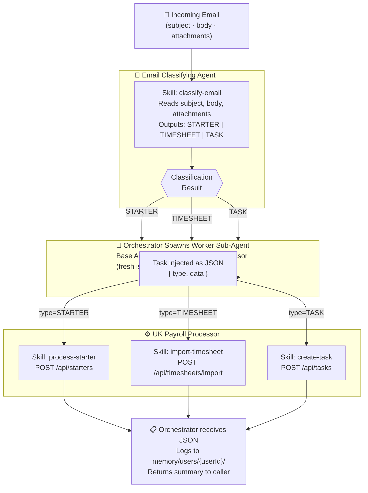

# Proposed Architecture Diagrams

## Diagram A — Plugin Lifecycle: Base Agent → Specialist

This diagram shows how the base framework initialises as a Generalist, detects an attached plugin,
mutates its identity, and handles a user request as a Specialist.
**This same lifecycle applies to every agent in the system — orchestrators and workers alike.**

**Written Explanation**: The agent always starts entirely generic — an empty vessel.
The Plugin Registry injects defining traits (name, SOUL, localised skills).
Once the identity transformation is complete, the agent enters a ready state,
strictly within the isolated bounds of whatever `userId` context is passed on each request.
**Workers follow this exact same lifecycle** — the orchestrator spawns a fresh base agent
and attaches the appropriate plugin before injecting the task.

---

## Diagram B — Workers are also Base Agents + Plugins

This diagram clarifies the key architectural principle: **there is no special "worker agent type".**
A worker sub-agent is simply a base agent with a plugin attached, running in an isolated context window.

**Written Explanation**: The orchestrator spawns the worker exactly like any agent is spawned —
base agent + plugin. The plugin gives the worker its identity and skills.
The worker executes, calls the API via its skill, and returns **only JSON** to the orchestrator.
Then the worker's context window is destroyed. There is no persistent worker process.

---

## Diagram C — Multi-User + Sub-Agent Architecture

This diagram shows how the system isolates multiple users simultaneously, while allowing the
orchestrator to spawn worker sub-agents to execute tasks in parallel or sequentially.

**Written Explanation**:
The `Base Agent Framework` is fully stateless between requests. When `User A` sends a message,
they are routed through their isolated memory (`/users/user-a/`). The `Orchestrator` inherits
its specialist persona from the active plugin. When solving the task, it decomposes and spawns
`Workers` in pristine context windows — each worker is also a base agent with a plugin attached.
Workers return raw structured JSON. The Orchestrator synthesises and saves the final context
strictly to `User A`'s memory. User B and User N remain entirely walled off.

---

## Diagram D — Email Processing Pipeline (End-to-End)

This diagram shows the full email classification and processing flow using the concrete business case.

