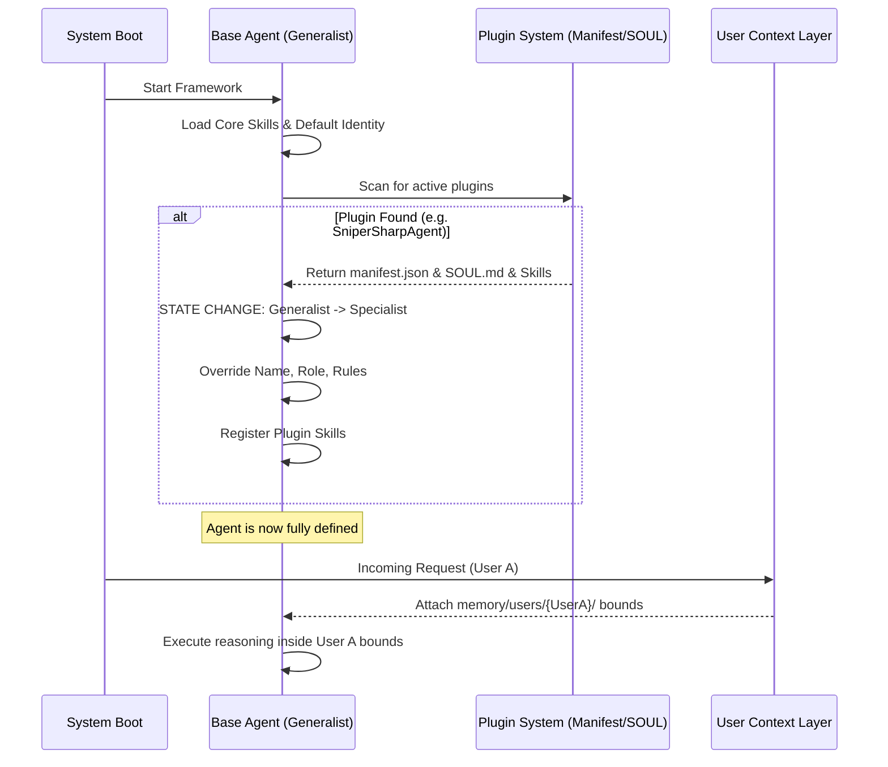
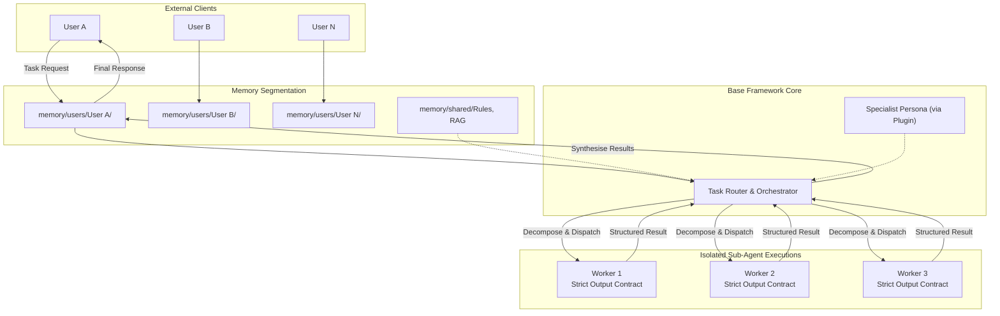

# Proposed Architecture Diagrams

## Diagram A — Plugin Lifecycle

This diagram demonstrates how the base framework initializes as a Generalist, detects an attached plugin, mutates its identity, and subsequently handles a user request as a Specialist.

**Written Explanation**: The agent always starts entirely generic. It acts like an empty vessel until the `Plugin System` injects defining traits (Name, SOUL, localized skills). Once the identity transformation is complete, the framework enters a "listening" state, ready to apply its specialized Persona strictly within the isolated bounds of whatever User Memory context is passed to it dynamically on a per-request basis.

---

## Diagram B — Multi-User + Sub-Agent Architecture

This diagram demonstrates how the system isolates numerous users simultaneously, while allowing the core Orchestrator to spawn bounded, parallel sub-agents to execute a complex task cleanly.

**Written Explanation**: 
The `Agent Core` is fully stateless between requests. When `User A` sends a message, they are routed through their isolated `MemSpace` (`/users/{User A}/`). The `Router` inherits the `Specialist Persona` shared system-wide. When solving the task, the `Router` acts as an Orchestrator: it decomposes the task and spawns parallel `Workers` in pristine context windows. The `Workers` return raw structured data. The `Router` synthesises this data and saves the final context strictly back to `User A`'s memory before delivering the result string to the user. User B and User N remain entirely unaffected and walled off.
