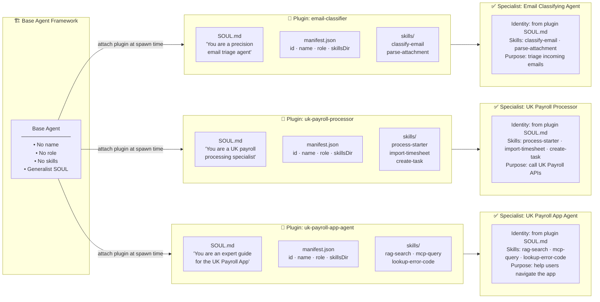
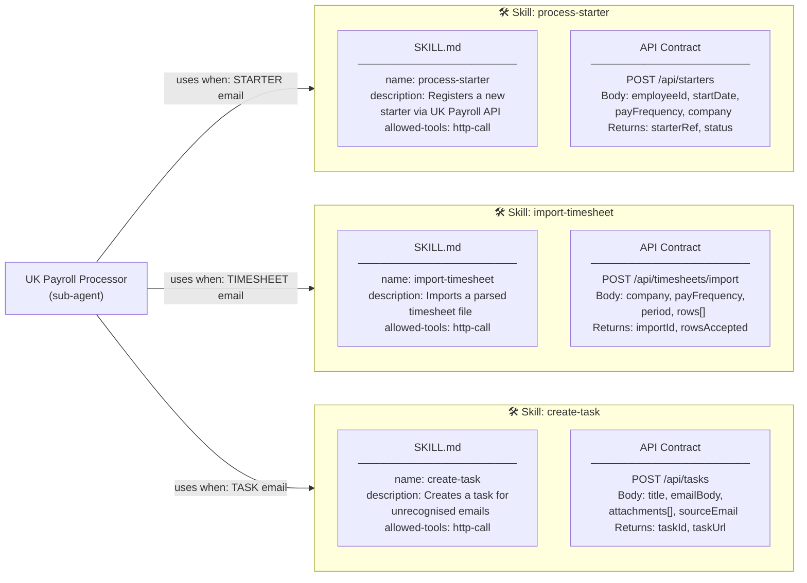
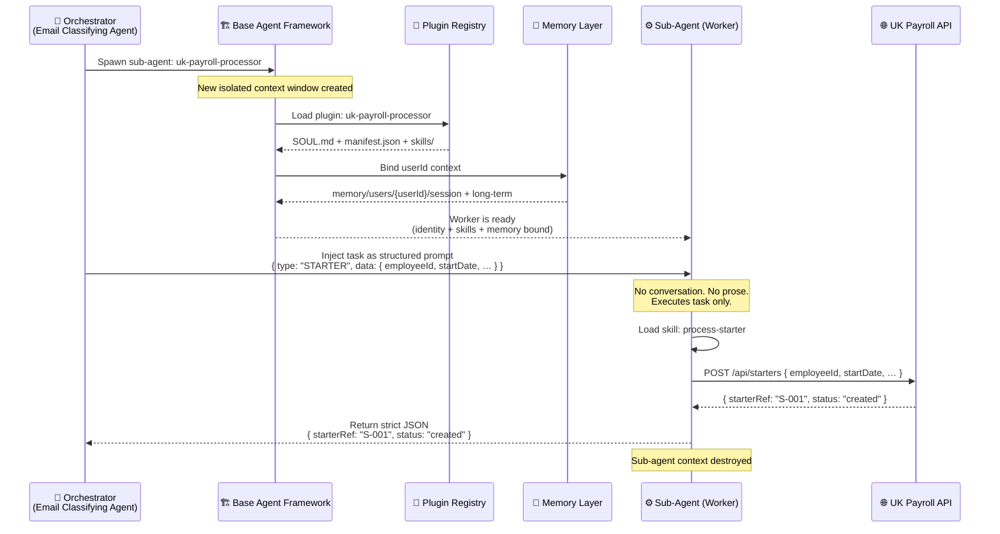
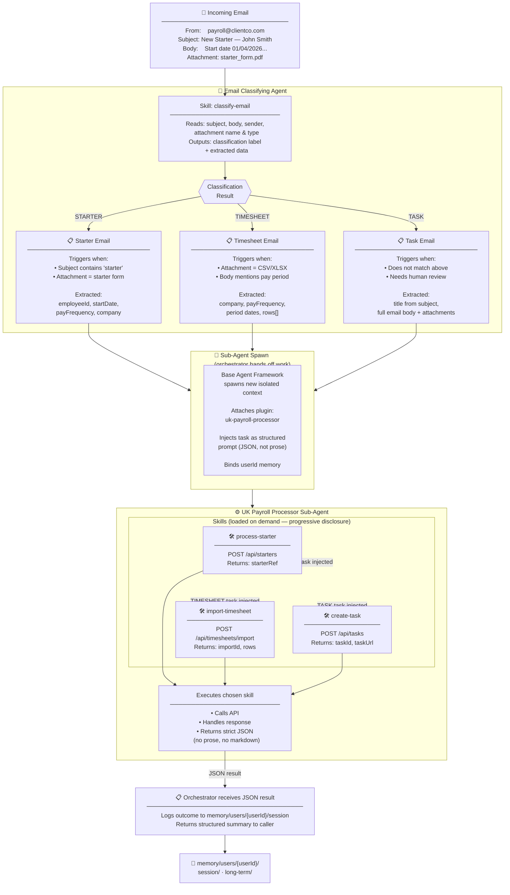
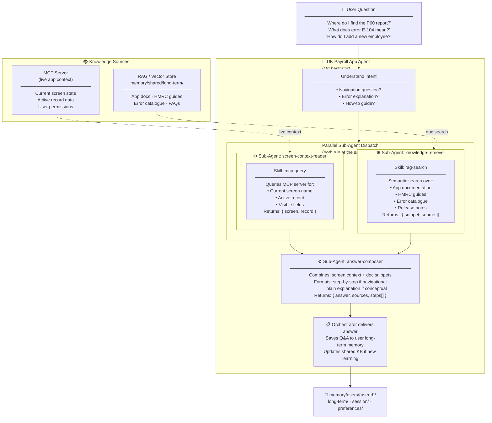
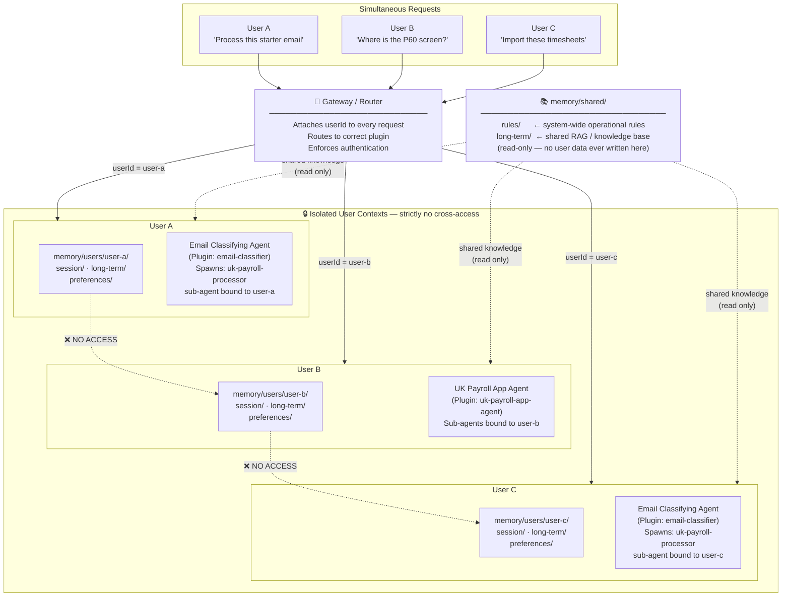
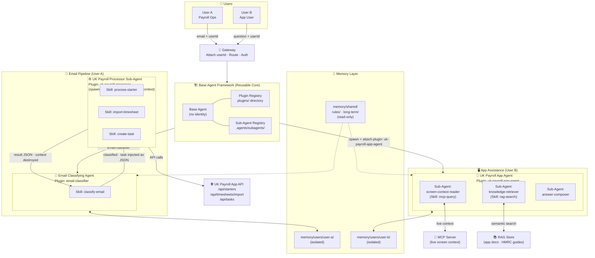

# System Overview Diagram

Visual map of the multi-agent system. Two specialist agents are shown:
the **Email Classifying Agent** and the **UK Payroll App Agent**.
Both are built by attaching a plugin to the same reusable base agent framework.

---

## Diagram 1 — The Core Idea: How a Plugin Creates a Specialist Agent

> The base agent has no name, no purpose, no identity. A plugin is attached at spawn time
> and transforms it into a specialist. The same base agent can be reused for any purpose.

---

## Diagram 2 — What Is a Skill?

> A skill is a focused capability — usually one API call. It knows the endpoint,
> the request shape, and the response shape. The agent loads a skill on demand
> and uses it to do real work.

---

## Diagram 3 — How a Sub-Agent Works (Lifecycle)

> The orchestrator spawns a sub-agent for each unit of work.
> The sub-agent runs in complete isolation, does one job, returns JSON, then stops.
> It never has a conversation — it just executes.

---

## Diagram 4 — Full Email Processing Flow (Main Business Flow)

> An email arrives. The Email Classifying Agent (orchestrator) reads it and decides what type it is.
> It then spawns the UK Payroll Processor sub-agent with the right task.
> The sub-agent uses the matching skill to call the API and returns a result.

---

## Diagram 5 — UK Payroll App Agent (Separate Agent — UI Assistance)

> This agent is completely separate from the email pipeline.
> Users ask questions about the app and it helps them navigate and understand it,
> using a knowledge base (RAG) and live app context (MCP).

---

## Diagram 6 — Multi-User Isolation

> Multiple users can use the system at the same time.
> Each user's memory is completely isolated. No user can ever see another user's data.
> Only shared rules and the shared knowledge base are accessible by all users.

---

## Diagram 7 — Complete Picture: Everything Together

---

## Summary: Key Concepts at a Glance

| Concept | What it is | Where it lives |
|---|---|---|
| **Base Agent** | Reusable framework with no identity — a blank slate | `src/core/` |
| **Plugin** | Specialisation package: SOUL + manifest + skills. Attached at spawn time. | `plugins/{name}/` |
| **SOUL.md** | Defines the agent's persona, tone, hard rules, and purpose | `plugins/{name}/SOUL.md` |
| **Skill** | One focused capability — usually one API call. Loaded on demand. | `plugins/{name}/skills/{skill}/SKILL.md` |
| **Orchestrator** | The agent that receives the task, decides what to do, spawns sub-agents | Any agent when acting as coordinator |
| **Sub-Agent (Worker)** | Spawned by orchestrator. Isolated context. Executes one task. Returns JSON only. | `.agents/subagents/{name}.yaml` |
| **Sub-Agent Plugin** | The worker is also a base agent with a plugin attached — same pattern | `plugins/{name}/` |
| **User Memory** | Fully isolated per user — session, long-term, preferences | `memory/users/{userId}/` |
| **Shared Memory** | Rules and knowledge base readable by all users (read-only) | `memory/shared/` |
| **MCP Server** | Provides live screen/record context to the App Agent | External sidecar process |
| **RAG Store** | Semantic search over app docs, HMRC guides, error catalogue | `memory/shared/long-term/` + vector DB |

### The One Rule That Ties It All Together

> **Plugin = Identity.** A base agent without a plugin is nothing.
> A base agent with a plugin is a specialist.
> Every agent in this system — orchestrators and workers alike — is a base agent with a plugin attached.
